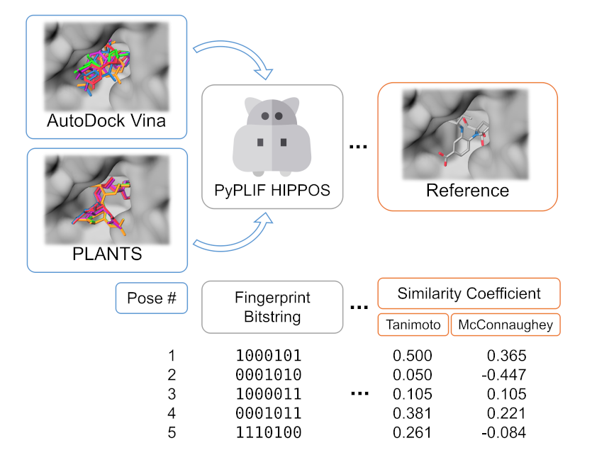
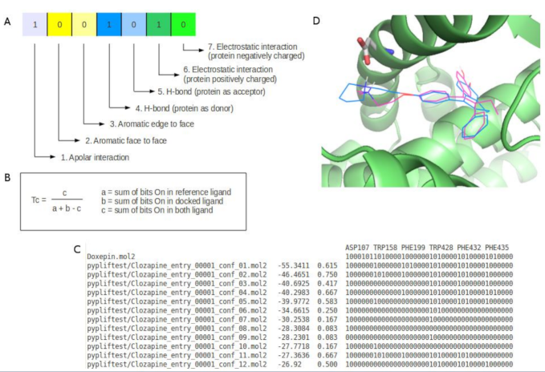

# PyPLIF HIPPOS: A Molecular Interaction Fingerprinting Tool for Docking Results of AutoDock Vina and PLANTS

   

   

  

Icons made by <a href="https://www.freepik.com/">Freepik</a> from <a href="http://www.flaticon.com">Flaticon</a> is licensed by CC 3.0 BY

Welcome to PyPLIF-HIPPOS's project page. PyPLIF-HIPPOS is an upgraded version of [PyPLIF](https://github.com/radifar/pyplif/) (**Python-based Protein-Ligand Interaction Fingerprinting**), a tool for molecular docking post-analysis. It will translate the 3D coordinates of both ligand(s) (generated from docking simulation) and protein into a series of *interaction bitstring* (also known as *Interaction Fingerprint*) (see image below). **HIPPOS** (/ˌhipoʊz/) is a recursive acronym of **HIPPOS Is PyPLIF On Steroids**. From this point forward, PyPLIF-HIPPOS is simplified to HIPPOS.

Compared to PyPLIF, HIPPOS is not only faster and able to generate more customized interaction bitstring, but also supports both [PLANTS](https://uni-tuebingen.de/fakultaeten/mathematisch-naturwissenschaftliche-fakultaet/fachbereiche/pharmazie-und-biochemie/pharmazie/pharmazeutische-chemie/pd-dr-t-exner/research/plants/) & [Vina](http://vina.scripps.edu/)! More over, unlike its predecessor it is (far) more well-documented.

  

Reprinted with permission from https://doi.org/10.1021/acs.jcim.0c00305. Copyright 2020 American Chemical Society.

  

Illustration by Radifar et al (2013) from <a href="http://www.bioinformation.net/009/97320630009325.htm">Bioinformation.net</a> is licensed by <a href="http://creativecommons.org/licenses/by/4.0">CC 4.0 BY</a>

## Quick Installation

The easiest way to install HIPPOS is using [Anaconda or Miniconda](https://docs.anaconda.com/anaconda/install/).
If you have Anaconda or Miniconda ready in your machine, you can start with
creating new environment (recommended):

`conda create -n hippos python=3.6`

Then activate the environment and install HIPPOS:

`conda activate hippos`  
`conda install -c conda-forge pyplif-hippos`

next you can try run HIPPOS and HIPPOS-GENREF with the following command:

`hippos`  
`hippos-genref` 

## How to Use HIPPOS

So I already installed HIPPOS, now what? Well you could start with how to generate
the [reference bitstring](https://pyplif-hippos.readthedocs.io/en/latest/getting-started-genref.html)
and Getting Started tutorial for [AutoDock Vina](https://pyplif-hippos.readthedocs.io/en/latest/getting-started-vina.html)
or [PLANTS](https://pyplif-hippos.readthedocs.io/en/latest/getting-started-plants.html).

## Ideas for Improvement? Found Bug(s)?

If you have any idea for improvement or found bug to report feel free to write them [here](https://github.com/radifar/PyPLIF-HIPPOS/issues).

## Citing HIPPOS

If you are using HIPPOS please cite this paper:

Istyastono, E., Radifar, M., Yuniarti, N., Prasasty, V. and Mungkasi, S., 2020. 
PyPLIF HIPPOS: A Molecular Interaction Fingerprinting Tool for Docking Results 
of AutoDock Vina and PLANTS. Journal of Chemical Information and Modeling, 60(8), pp.3697-3702.
https://doi.org/10.1021/acs.jcim.0c00305

## Acknowledgment

This project has received funding from the [National Agency for Research and Innovation](https://international.ristekdikti.go.id/) (Indonesia)
under grant agreement No. 807.7/LL5/PG/2020. This project has been restructured based on the
[MOLSSI Computational Molecular Science Python Cookiecutter](https://github.com/molssi/cookiecutter-cms)
version 1.3, and benefited greatly from [MOLSSI Python Package Development Best Practices](https://molssi.org/2020/04/20/may-webinar-series-python-package-development/)
workshop.

-----

&copy; Copyright 2021, Muhammad Radifar & Enade Perdana Istyastono
