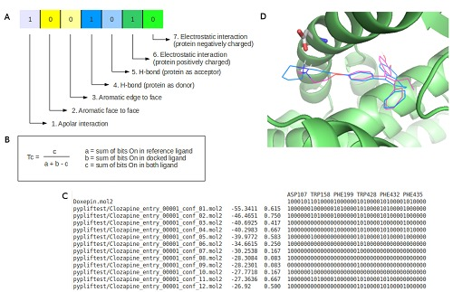

PyPLIF HIPPOS: A Molecular Interaction Fingerprinting Tool for Docking Results of Autodock Vina and PLANTS
==========================================================================================================

.. image:: hippopotamus.png
	:alt: Icons made by Freepik from Flaticon is licensed by CC 3.0 BY
	:align: center
	:scale: 45%
	
.. raw:: html
	:file: docs/source/attribution-hippos.html

Welcome to PyPLIF-HIPPOS's project page. PyPLIF-HIPPOS is an upgraded version of `PyPLIF <https://github.com/radifar/pyplif/>`_ (**Python-based Protein-Ligand Interaction Fingerprinting**), a tool for molecular docking post-analysis. It will translate the 3D coordinates of both ligand(s) (generated from docking simulation) and protein into a series of *interaction bitstring* (also known as *Interaction Fingerprint*) (see image below). **HIPPOS** (/ˌhipoʊz/) is a recursive acronym of **HIPPOS Is PyPLIF On Steroids**. From this point forward, PyPLIF-HIPPOS is simplified to HIPPOS.

Compared to PyPLIF, HIPPOS is not only faster and able to generate more customized interaction bitstring, but also supports both `PLANTS <https://uni-tuebingen.de/fakultaeten/mathematisch-naturwissenschaftliche-fakultaet/fachbereiche/pharmazie-und-biochemie/pharmazie/pharmazeutische-chemie/pd-dr-t-exner/research/plants/>`_ & `VINA <http://vina.scripps.edu/>`_! More over, unlike its predecessor it is (far) more well-documented.

If you are using HIPPOS please cite this paper:

Istyastono, E., Radifar, M., Yuniarti, N., Prasasty, V. and Mungkasi, S., 2020.
PyPLIF HIPPOS: A Molecular Interaction Fingerprinting Tool for Docking Results
of AutoDock Vina and PLANTS. Journal of Chemical Information and Modeling,.
https://doi.org/10.1021/acs.jcim.0c00305

.. raw:: html
	:file: attribution-pyplif.html

-----

.. role::  raw-html(raw)
    :format: html
:raw-html:`&copy;` Copyright 2020, Muhammad Radifar & Enade Perdana Istyastono
