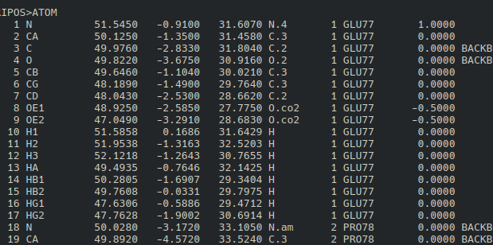
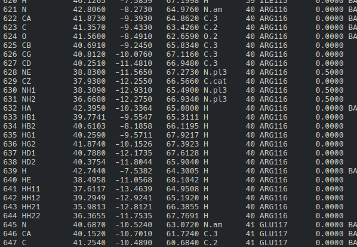
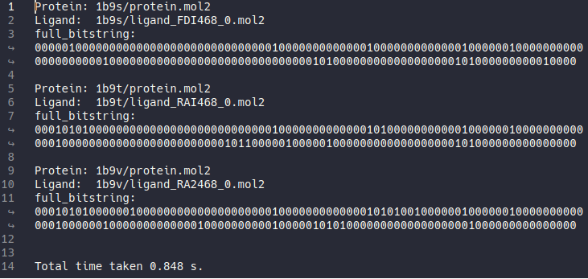
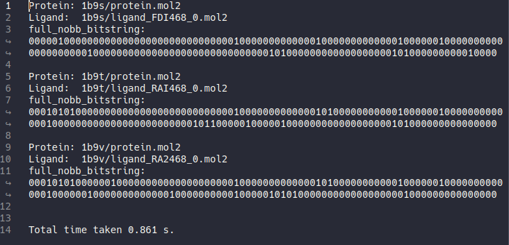
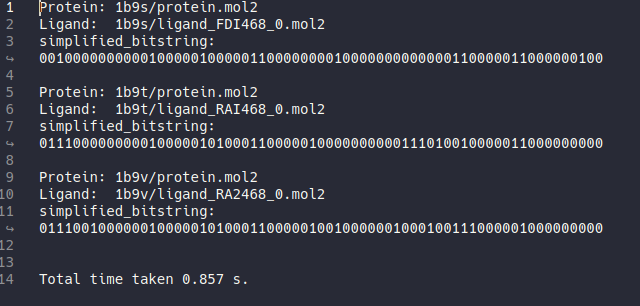

Generating Reference Bitstring using HIPPOS-genref
==================================================

Generating Reference Bitstring with Backbone (Default Setting)
--------------------------------------------------------------

Reference bitstring is an essential requirement for similarity coefficient (eg. Tanimoto
or McConnaughey coefficient) calculation, which is the common method for comparing
the interaction fingerprinting of a test compound and a reference (native ligand)
interactions on certain protein.

To generate Reference bitstring, first of all, you need to open the command prompt and enter the 
``examples\01-na_reference`` folder. This example uses the Neuraminidase enzyme
for two reasons, first, it is one of the enzymes used in DUD-E (Directory of Useful
Decoy Enhanced) therefore you could use it to measure the effect of interaction fingerprinting
on the enrichment factor. Second, it can demonstrate all of the seven interaction types in
interaction fingerprinting.

As you can see there are three folders and two txt configuration files. Each folder represents
a crystal structure of Neuraminidase, and contain the original PDB file and the
split component (protein, ligand, and water) generated with 
`SPORES <https://uni-tuebingen.de/fakultaeten/mathematisch-naturwissenschaftliche-fakultaet/fachbereiche/pharmazie-und-biochemie/pharmazie/pharmazeutische-chemie/pd-dr-t-exner/research/spores/>`_. PDB file alone 
can not be used as the reference, it has to be in mol2 or pdbqt to ensure that the 
atom typing, charge assignment, and protonation is identical to the docking environment 
(whether for PLANTS or VINA). So the PDB files here only act as
the source if you want to use PDBQT files as the reference instead. **1b9s**,
**1b9t**, and **1b9v** are the PDB ID of the same Neuraminidase, where each of them
bound to  different ligand (**FDI**, **RAI**, and **RA2** respectively). Therefore 
the protein name and ligand name should use protein.mol2 and the corresponding ligand 
file name as you can see in ``genref-config.txt``. ::

	# first residue is 77
	residue_name	ARG116 GLU117 LEU132 LYS148 ASP149 ARG150 ARG154 TRP177 SER178 ILE221 ARG223 THR224 GLU226 ALA245 HIS273 GLU275 GLU276 ARG292 ASP294 GLY347 ARG374 TRP408 TYR409
	residue_number	40 41 56 72 73 74 78 101 102 145 147 148 150 169 197 199 200 216 218 271 298 332 333

	proteins	1b9s/protein.mol2 1b9t/protein.mol2 1b9v/protein.mol2
	ligands		1b9s/ligand_FDI468_0.mol2 1b9t/ligand_RAI468_0.mol2 1b9v/ligand_RA2468_0.mol2

	outfile		ref-results.txt

.. _residue-numbering:

The first line is merely the commented line, everything started with ``#`` sign will
be ignored by ``hippos`` and ``hippos-genref``. If you open the mol2 protein file with a text editor
you will see that the first residue is Glutamate with residue number 77. However, when
the file is read by Openbabel it will count as residue number 1. 

This is where things started to get tricky, because we have to supply both ``residue_name``
and ``residue_number`` properly, or else it will not work as to how we want it to be.
``residue_name`` can be acquired easily by converting your protein into mol2 format, while
the corresponding ``residue_number`` must be retrieved from the column before residue name 
(eg. residue name ARG116 and GLU117 correspond to residue number 40 and 41 respectively):

The ``residue_name`` and ``residue_number`` in ``genref-config`` above are retrieved by
visualizing any residue within 5 angstroms from the native ligand using VMD (you can use
any other molecule visualization tool), regardless of how important the residue in
enzyme inhibition.

The next lines are ``proteins`` and ``ligands``, notice that there are 3 protein molecules
and 3 ligand molecules which means that there are 3 protein-ligand pairs as references. Where
the first protein will be matched with first ligand and so on. However in most cases, one
protein-ligand pair is enough, this example uses 3 protein-ligand pairs as a demonstration
of multiple references.

The last line is the output file name, it is optional so when not defined the output file
will be genref-results.txt.

After we understand the input file and the configuration file, hippos-genref could be run with the following command: ::

	hippos-genref genref-config.txt

After hippos-genref finished file ``ref-results.txt`` will be generated.

Inside ref-results.txt we can see that there are 3 results from 3 protein-ligand pairs.
Each result consisted of protein-ligand pair name and interaction bitstring where each 
residue represented by 7 bit of interactions from both the side-chain and the backbone.

.. _genref-nobb:

Generating Reference Bitstring without Backbone
-----------------------------------------------

Sometimes we would like to omit the interaction between ligand and the backbone protein.
In that case, we should change the ``output_mode`` to ``full_nobb`` by adding 
``output_mode full_nobb`` to our hippos-genref config file as appear in ``genref-config-nobb.txt`` ::

	# first residue is 77
	residue_name  ARG116 GLU117 LEU132 LYS148 ASP149 ARG150 ARG154 TRP177 SER178 ILE221 ARG223 THR224 GLU226 ALA245 HIS273 GLU275 GLU276 ARG292 ASP294 GLY347 ARG374 TRP408 TYR409
	residue_number  40 41 56 72 73 74 78 101 102 145 147 148 150 169 197 199 200 216 218 271 298 332 333

	proteins    1b9s/protein.mol2 1b9t/protein.mol2 1b9v/protein.mol2
	ligands     1b9s/ligand_FDI468_0.mol2 1b9t/ligand_RAI468_0.mol2 1b9v/ligand_RA2468_0.mol2

	output_mode full_nobb

	outfile     ref-results-nobb.txt

Now run hippos-genref again with the following command: ::

	hippos-genref genref-config-nobb.txt

After hippos-genref finished file ``ref-results-nobb.txt`` will be generated.

Just like in the default setting, it will generate 3 results. And although they
appear the same as before, this time the bitstrings are generated without
taking backbone atoms into account.

.. _genref-simplified:

Generating Simplified Reference Bitstring
-----------------------------------------

It is also possible to calculate simplified interaction between ligand and the backbone protein.
In that case, we should change the ``output_mode`` to ``simplified`` by adding 
``output_mode simplified`` to our hippos-genref config file as appear in ``genref-config-simplified.txt`` ::

	# first residue is 77
	residue_name  ARG116 GLU117 LEU132 LYS148 ASP149 ARG150 ARG154 TRP177 SER178 ILE221 ARG223 THR224 GLU226 ALA245 HIS273 GLU275 GLU276 ARG292 ASP294 GLY347 ARG374 TRP408 TYR409
	residue_number  40 41 56 72 73 74 78 101 102 145 147 148 150 169 197 199 200 216 218 271 298 332 333

	proteins    1b9s/protein.mol2 1b9t/protein.mol2 1b9v/protein.mol2
	ligands     1b9s/ligand_FDI468_0.mol2 1b9t/ligand_RAI468_0.mol2 1b9v/ligand_RA2468_0.mol2

	output_mode simplified

	outfile     ref-results-simplified.txt

Now run hippos-genref again with the following command: ::

	hippos-genref genref-config-simplified.txt

After hippos-genref finished file ``ref-results-simplified.txt`` will be generated.

Just like in the default setting, it will generate 3 results. And although they
appear the same as before, this time the bitstrings are simplified.

..
	Generating Multiple Reference Bitstring
	---------------------------------------

	HIPPOS-genref is also capable of outputting multiple output_mode. Currently,
	there are three output_mode available: full, full_nobb, and :ref:`simplified<simplified-rule>`. To
	generate more than one output_mode the output_mode parameter can be concatenated
	by separating each parameter with blank space. In the example below (``genref-config-multi.txt``), 
	two parameters are used: ``full`` and ``simplified`` ::

		# first residue is 77
		residue_name  ARG116 GLU117 LEU132 LYS148 ASP149 ARG150 ARG154 TRP177 SER178 ILE221 ARG223 THR224 GLU226 ALA245 HIS273 GLU275 GLU276 ARG292 ASP294 GLY347 ARG374 TRP408 TYR409
		residue_number  40 41 56 72 73 74 78 101 102 145 147 148 150 169 197 199 200 216 218 271 298 332 333

		proteins    1b9s/protein.mol2 1b9t/protein.mol2 1b9v/protein.mol2
		ligands     1b9s/ligand_FDI468_0.mol2 1b9t/ligand_RAI468_0.mol2 1b9v/ligand_RA2468_0.mol2

		output_mode full simplified

		outfile     ref-results-multi.txt

	Using the above configuration file, hippos-genref could be run with the
	following command: ::

		hippos-genref genref-config-multi.txt

	After hippos-genref finished file ``ref-results-multi.txt`` will be generated.

	.. image:: 03-ref-results-multi.png
		:alt: ref-results-multi.txt from hippos-genref
		:align: center

	In this example, for every protein ligand pair two bitstrings are generated. One
	is for full, and the other one is for simplified bitstring.