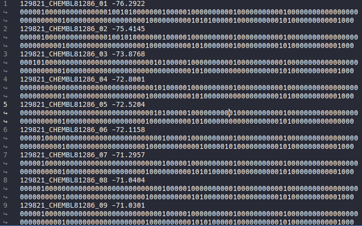
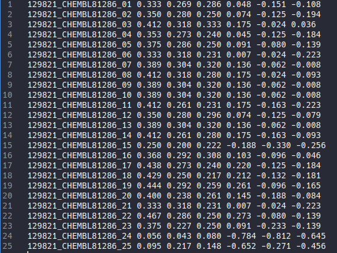
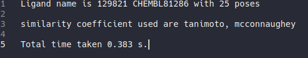

Getting Started (HIPPOS on PLANTS)
===================================

There are two ways to use HIPPOS, the first one is to use HIPPOS without any
reference, and the second one is to use HIPPOS with reference and calculate
the similarity coefficient against the reference.

Generating Protein-Ligand Interaction Bitstring without reference
------------------------------------------------------------------------------------------

First, enter the examples folder and check the configuration example for this 
method, ``config-plants-na-notc.txt`` ::

	docking_method    plants    # plants or vina
	docking_conf      02-na_plants/plants-003.conf

	residue_name  	  ARG116 GLU117 LEU132 LYS148 ASP149 ARG150 ARG154 TRP177 SER178 ILE221 ARG223 THR224 GLU226 ALA245 HIS273 GLU275 GLU276 ARG292 ASP294 GLY347 ARG374 TRP408 TYR409
	residue_number    40 41 56 72 73 74 78 101 102 145 147 148 150 169 197 199 200 216 218 271 298 332 333

	full_outfile plants_notc_ifp.csv
	logfile plants_notc.log

The configuration here is pretty much self-explaining. ``docking_method`` here is plants,
which correspond to the docking result we would like to analyse. Then the ``docking_conf``
is the configuration file used for docking, HIPPOS require this file to find the details 
about docking input and output from PLANTS.

For ``residue_name`` and ``residue_number`` check the 
:ref:`explanation for the configuration on generating reference with Hippos-genref <residue-numbering>` 
for more details.

Next, you can run HIPPOS by entering the following command: ::

	hippos config-plants-na-notc.txt

After the calculation finished HIPPOS will generate 2 files, hippos.log and plants_notc_ifp.csv. 
plants_notc.log contain the information about ligand name, number of poses, and the running time.
If output_mode set to simplified or combo there will be a table for bit position 
for each residue (useful for deciphering the simplified bitstring). The plants_notc_ifp.csv file will contain the ligand name,
pose number, energy from docking result, and the interaction bitstring as can be seen below:

In the next section you will learn how to not only generate the interaction bitstring but
also calculate the similarity coefficient using reference bitstring.

Generating Protein-Ligand Interaction Bitstring and Similarity coefficient
-----------------------------------------------------------------------------

This procedure will require a reference bitstring which can be generated using
hippos-genref included in the package. Open this :doc:`link <getting-started-genref>`
to learn how to generate the reference bitstring.

After we acquire the full bitstring we can use it for reference bitstring
as shown in ``examples/04-na_config_default/config-plants-na-tc-mc.txt`` which is the configuration file for HIPPOS ::

	docking_method    plants    # plants or vina
	docking_conf      ../02-na_plants/plants-003.conf

	similarity_coef   tanimoto mcconnaughey

	full_ref  00000100000000000000000000000000000100000000000001000000000000010000001000000000000000000001000000000000000000000000000000101000000000000000000101000000000010000 00010101000000000000000000000000000100000000000001010000000000010000001000000000000010000000000000000000000001011000001000001000000000000000000101000000000000000 00010101000000100000000000000000000100000000000001010100100000010000001000000000000010000001000000000000010000000000100000101010000000000000000001000000000000000

	residue_name ARG116 GLU117 LEU132 LYS148 ASP149 ARG150 ARG154 TRP177 SER178 ILE221 ARG223 THR224 GLU226 ALA245 HIS273 GLU275 GLU276 ARG292 ASP294 GLY347 ARG374 TRP408 TYR409
	residue_number 40 41 56 72 73 74 78 101 102 145 147 148 150 169 197 199 200 216 218 271 298 332 333

	full_outfile plants_full_ifp.csv
	sim_outfile plants_similarity.csv
	logfile plants.log

**Always remember that full_ref should be using the full bitstring from reference.
Using bitstring reference of different length will cause an error and the program will stop.**

Here the residue_name and residue_number must be the same as the one used for reference
bitstring generation, and you have to set ``similarity_coef`` value, such as tanimoto
or mccounaughey or both of them.

``docking_method`` here is plants which correspond to the docking result we would like to
analyse. Then the ``docking_conf`` is the configuration file used for docking, HIPPOS require
this file to find the details about docking input and output from PLANTS.

Next, run HIPPOS with the following command inside ``examples`` directory: ::

	hippos config-plants-na-tc-mc.txt

there will be 3 output file plants.log, plants_similarity.csv, and plants_full_ifp.csv. The plants_full_ifp.csv
will be the same as the one without reference above. The plants_similarity.csv contain the 
similarity coefficient for every pose comparison. Notice
that there are 6 similarity coefficient results which correspond to Tanimoto
coefficient and McConnaughey coefficient calculation for 3 reference bitstring

Last but not least the plants.log contain the information about ligand name, number of
poses, similarity coefficient used, and the table for bit position for each residue
(only appear when output_mode set to simplified, useful for deciphering the
simplified bitstring), and the total time taken.

Generating Protein-Ligand Interaction Bitstring and Similarity coefficient (without Backbone)
---------------------------------------------------------------------------------------------

The example above is the default setting where the interaction between ligand and protein backbone
is included. To omit the interaction between ligand and protein backbone, we need to set the
``output_mode`` value to ``full_nobb``, and in order for this setting to work properly we also need to
change the bitstring reference (``full_nobb_ref``) accordingly
(:ref:`see how to generate bitstring reference without backbone <genref-nobb>`).
Here is the content of configuration file example ``examples/05-na_config_nobb/config-plants-na-tc-mc.txt``) ::

	docking_method    plants    # plants or vina
	docking_conf      ../02-na_plants/plants-003.conf

	similarity_coef   tanimoto mcconnaughey

	output_mode full_nobb

	full_nobb_ref  00000100000000000000000000000000000100000000000001000000000000010000001000000000000000000001000000000000000000000000000000101000000000000000000101000000000010000  00010101000000000000000000000000000100000000000001010000000000010000001000000000000010000000000000000000000001011000001000001000000000000000000101000000000000000  00010101000000100000000000000000000100000000000001010000000000010000001000000000000010000001000000000000010000000000100000101010000000000000000001000000000000000

	residue_name ARG116 GLU117 LEU132 LYS148 ASP149 ARG150 ARG154 TRP177 SER178 ILE221 ARG223 THR224 GLU226 ALA245 HIS273 GLU275 GLU276 ARG292 ASP294 GLY347 ARG374 TRP408 TYR409
	residue_number 40 41 56 72 73 74 78 101 102 145 147 148 150 169 197 199 200 216 218 271 298 332 333

	full_nobb_outfile plants_nobb_ifp.csv
	sim_outfile plants_similarity.csv
	logfile plants.log

**Always remember that full_nobb_ref should be using the full_nobb bitstring from reference.
Using bitstring reference of different length will cause an error and the program will stop.**

Like before, run ``hippos`` with the following command: ::

	hippos config-plants-na-tc-mc.txt

Just like before, 3 output file will be generated, but the fingerprint (``plants_nobb_ifp.csv``)
and plants_similarity.csv will be different.

Generating Simplified Interaction Bitstring and Similarity coefficient
----------------------------------------------------------------------

It is also possible to calculate simplified interaction between ligand and protein. To do so set the
``output_mode`` value to ``simplified``, and in order for this setting to work properly we also need to
change the bitstring reference (``simplified_ref``) accordingly 
(:ref:`see how to generate simplified bitstring reference <genref-simplified>`).
Here is the content of configuration file example ``examples/06-na_config_simplified/config-plants-na-tc-mc.txt`` ::

	docking_method    plants    # plants or vina
	docking_conf      ../02-na_plants/plants-003.conf

	similarity_coef   tanimoto mcconnaughey

	output_mode simplified

	simplified_ref  0010000000000100000100000110000000010000000000000110000011000000100  0111000000000100000101000110000010000000000111010010000011000000000  0111001000000100000101000110000010010000001000100111000001000000000

	residue_name ARG116 GLU117 LEU132 LYS148 ASP149 ARG150 ARG154 TRP177 SER178 ILE221 ARG223 THR224 GLU226 ALA245 HIS273 GLU275 GLU276 ARG292 ASP294 GLY347 ARG374 TRP408 TYR409
	residue_number 40 41 56 72 73 74 78 101 102 145 147 148 150 169 197 199 200 216 218 271 298 332 333

	simplified_outfile plants_simplified_ifp.csv
	sim_outfile plants_similarity.csv
	logfile plants.log

**Always remember that simplified_ref should be using the simplified bitstring from reference.
Using bitstring reference of different length will cause an error and the program will stop.**

Like before, run ``hippos`` with the following command: ::

	hippos config-plants-na-tc-mc.txt

Just like before, 3 output file will be generated, but the fingerprint (``plants_simplified_ifp.csv``)
and plants_similarity.csv will be different.

Generating Multiple Interaction Bitstring
-----------------------------------------

Last but not least, multiple output_mode is also allowed in generation interaction bitstring but without calculation of similarity coefficient. Here is the content of the configuration file example ``examples/07-na_config_multiple/config-plants-na.txt`` ::

	docking_method    plants    # plants or vina
	docking_conf      ../02-na_plants/plants-003.conf

	output_mode full full_nobb simplified

	residue_name ARG116 GLU117 LEU132 LYS148 ASP149 ARG150 ARG154 TRP177 SER178 ILE221 ARG223 THR224 GLU226 ALA245 HIS273 GLU275 GLU276 ARG292 ASP294 GLY347 ARG374 TRP408 TYR409
	residue_number 40 41 56 72 73 74 78 101 102 145 147 148 150 169 197 199 200 216 218 271 298 332 333

	full_outfile plants_full.csv
	full_nobb_outfile plants_nobb.csv
	simplified_outfile plants_simplified_ifp.csv
	logfile plants.log

Like before, run ``hippos`` with the following command: ::

	hippos config-plants-na.txt

Now, four output file will be generated, three for three different output, and one for the log file.

..	
	Preparing docking file for PLANTS
	---------------------------------
	
	Preparing configuration file for PLANTS
	---------------------------------------
	
	Running simple docking in PLANTS
	--------------------------------
	
	Running IFP analysis with HIPPOS
	--------------------------------
